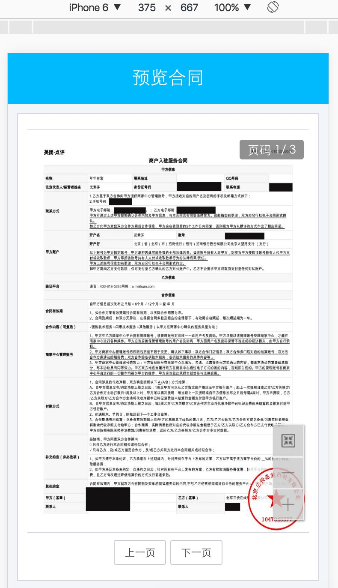

# pdf-img-viewer

###1.基于h5-base.js
[h5-base](https://github.com/geneking/h5-common)

### 2.如何调用

#### （1）Zepto调用

```javascript
//pdf预览初始化
var imgList = [
  './demo/images/1.jpg',
  './demo/images/2.jpg',
  './demo/images/3.jpg'
];
$.pdfView({
  pageCount: 3,          //总页数
  imgList: imgList,      //图片数组
  previewBox: $('.grid') //装载容器
});
```
#### （2）require调用

```javascript
var pdf = require('pdf-view');
//pdf预览初始化
var imgList = [
  './demo/images/1.jpg',
  './demo/images/2.jpg',
  './demo/images/3.jpg'
];
pdf.pdfView({
  pageCount: 3,          //总页数
  imgList: imgList,      //图片数组
  previewBox: $('.grid') //装载容器
});
```

### 3.下载查看index.html预览demo

